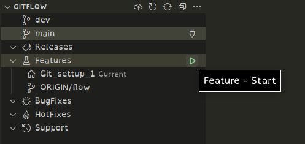
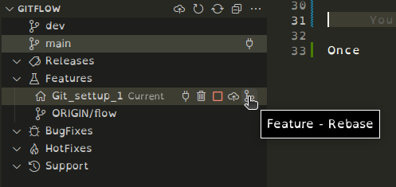
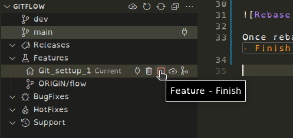

# ig-drasil-connect
Amazon connect project

# Repo information

This repo uses the git flow development structure.

To help with development, it is recommended to use the extension:

```
Name: Git Flow
Id: Serhioromano.vscode-gitflow
Description: Git-Flow support for VS Code
Version: 1.3.25
Publisher: Sergey Romanov
VS Marketplace Link: https://marketplace.visualstudio.com/items?itemName=Serhioromano.vscode-gitflow
```

> Note: main branch is protected. Please merge to dev.

## Create a new "Feature"

To create a new feature, go to "Source control", open GITFLOW, and press on `Feature - Start`.



> Note: use the following syntax for new Features: `<team>/<feature name>`
>
> For example, if you are team 1, and are working on the android app, create it as: `team1/android_app`.

## Merge with dev / finish the feature

Again, under the GITFLOW tab, first press `Feature - Rebase` to ensure you are on the latest version.



Once rebased, you can finish your version and merge it to dev by clicking on `Feature - Finish`.



Once finished, upload the changes. 

> Note: this will not delete the branch. You might want to delete the branch later.
